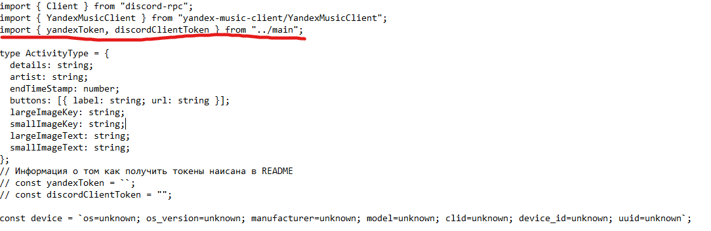
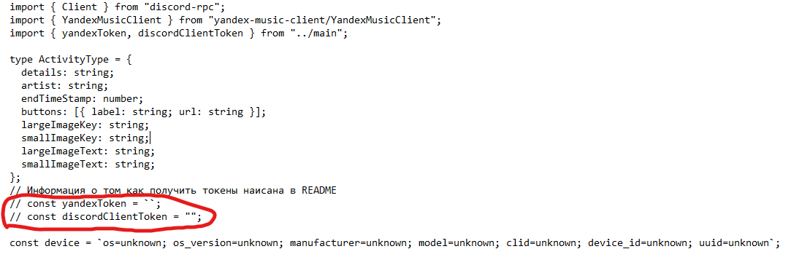

# Активность Discord с Яндекс.Музыкой

# Для работы требуется:

- [Node](https://nodejs.org/en/)

- [discord-rpc](https://www.npmjs.com/package/@xhayper/discord-rpc)

- [yandex-music-client](https://www.npmjs.com/package/yandex-music-client)

## Чтобы начать работу есть 2 варианта
# 1
Запускаем start.bat
Там, через консоль вписываем yandexToken и discordClientToken. 
Это кривой вариант, нужно запустить файл 3 раза.
Сначала запускаем, пишем 1 и вставляем yandex token, после чего консоль закроеться.
После чего проделываем те же манипуляции с discord token.
И на третий раз пишем start. Если все данные введены правильно, то программа заработает.
Если данные введене неправильно, то нужно удалить их из export.ts и оставить `export { yandexToken, discordClientToken };`
# 2
Если вы выбрали 2 вариант, то можно удалить файл exports.ts
Заходим в папку src, открываем файл index.ts
Удаляем эту строку

У этих 2 строк убираем `//` в начале

И вписываем в эти строки нужные данные

# Настройки в index.js

1. ym_token:
   Получение токена яндекс музыки: https://github.com/MarshalX/yandex-music-api/discussions/513
   Удобнее всего использовать расширение для браузера:

   - [chrome](https://chromewebstore.google.com/detail/yandex-music-token/lcbjeookjibfhjjopieifgjnhlegmkib) -[Firefox](https://addons.mozilla.org/en-US/firefox/addon/yandex-music-token/)

2. device:
   Получение девайса:

- Скачиваем [HTTP Analyze](https://www.ieinspector.com/httpanalyzer/download.html)
- Тыкаем Start слева сверху
- Ищем яндекс музыку и копируем X-Yandex-Music-Device

3. clientId:
   Где взять clientId?

- Заходим на [Discord Developer Portal](https://discord.com/developers/applications) в приложение, если его нет - создаем. **Название приложения это заголовок RPC**
- Тыкаем на вкладку OAuth2 слева
- Копируем Client ID (он общедоступный, скрывать не надо)

## Если не хотите создавать приложение - по умолчанию будет заголовок "Yandex Music"

# Известные проблемы:

1. Не отображается трек, когда играет радио
2. Если поставить трек на паузу - RPC выключится только по окончанию таймера
3. Если поставить трек на повтор - активность выключится после первого проигрывания

Данные проблемы связаны с самой Яндекс.Музыкой

Оригинальный репозиторий: [https://github.com/KailHet/ymDiscordRPC](https://github.com/KailHet/ymDiscordRPC)
